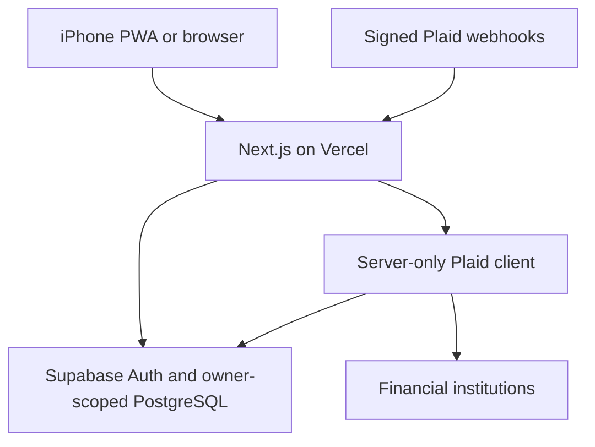

# Still

A calm, private, mobile-first personal budgeting application. Next.js App Router, TypeScript, React, Tailwind CSS, Supabase PostgreSQL/Auth, Plaid Transactions Sync, and an installable iPhone PWA.

## What is implemented

- Private email/password sign-in with a server-enforced email allowlist, session refresh, and user-owned data.
- Monthly budget overview, spent/remaining/percentage, text warning states, month navigation, category detail, and estimates.
- Sixteen default categories, custom categories, icons, optional parents, recurring defaults, monthly overrides, archive/restore, reorder, and safe deletion with transaction reassignment.
- Merchant/description rules with priorities, toggles, edits, deletion, exclusion rules, and manual override precedence.
- Transactions with search and month/category/account/institution/pending/inclusion filters, details, notes, category changes, and inclusion overrides.
- Multiple bank connections, account inclusion, masked account identifiers, cached balances, last-sync timestamps, and Plaid update-mode reconnection.
- Real server-side Plaid Link/token exchange, AES-256-GCM encrypted token storage, incremental sync, signed webhook verification, pagination mutation recovery, and atomic cursor checkpoints.
- Refunds reduce spending; transfers, income, credit-card repayments, excluded accounts, and removed transactions do not count. Pending inclusion defaults on. Pending-to-posted reconciliation preserves manual edits.
- Monthly comparisons, small charts, optional budget recommendations, light/dark/system appearance, CSV export, and first-use guidance.
- Explicit demo at `/demo`, with synthetic data and device-local demo edits. Private workspaces never import or fall back to demo financial data.
- Manifest, PNG/maskable/Apple icons, safe-area layouts, mobile navigation, and a public offline fallback. Service workers never cache authenticated pages or API responses.

## Architecture



`lib/budget/logic.ts` is the deterministic source for financial calculations. The authenticated data loader calculates monthly summaries on the server; the UI and the isolated demo reuse the same functions. No cross-user application caches are used. Displayed sync timestamps come from bank sync checkpoints, not page-load timestamps.

Plaid credentials live only in server environment variables. Access tokens are encrypted with a 32-byte application key and authenticated owner id, then saved in `plaid_tokens`. That table has RLS, no anonymous/authenticated privileges or policies, and is never part of client payloads. Server-only service credentials perform ingestion; normal app CRUD uses the authenticated user's RLS client. Composite foreign keys prevent cross-owner account/category references.

A sync lease protects against concurrent webhook/manual jobs. All added, modified, removed, reconciled pending transactions and the cursor commit in one PostgreSQL function. If pagination mutates, fetching restarts at the last committed cursor. If syncing fails, the prior cached history remains available and no partial cursor is committed.

## Directory overview

```text
app/                  App Router screens, auth, manifest, loading/error boundaries
app/api/data/         Validated, authenticated data and mutation endpoint
app/api/plaid/        Link, exchange, sync, and signed webhook endpoints
components/           Responsive shell, dialogs, editors, bank connection UI
lib/budget/           Central financial calculations and recommendations
lib/categories/       Defaults and Plaid category mapping
lib/plaid/            Server client, encryption, paging, sync, webhook validation
lib/supabase/         Request-scoped authenticated and server-only admin clients
lib/demo*             Synthetic data and independent local demo mutations
supabase/migrations/  Schema, RLS, indexes, seed initialization, atomic sync functions
tests/                Finance, encryption, pagination, SQL integration, browser tests
public/               Icons, service worker, public offline screen
scripts/              Reproducible icon generation
```

## Run locally

Use Node.js 24 and npm. Dependencies are pinned and the lockfile is committed.

```bash
git clone https://github.com/musabrashid/budget-app.git
cd budget-app
npm ci
cp .env.example .env.local
npm run dev
```

Open `http://localhost:3000/demo` to try the full demo without financial credentials. Changes to this synthetic workspace persist in localStorage under `still-demo-v1`; **Reset demo** in Settings removes them. For a live workspace configure the variables below, create your Auth user, and open `/login`.

```bash
npm run lint
npm run typecheck
npm test
npm run build
npm run start
```

## Environment variables

Never commit `.env.local`, real secrets, tokens, passwords, or production data. Never prefix a private server key with `NEXT_PUBLIC_`.

| Variable                               | Required for                   | Source                                                                                          |
| -------------------------------------- | ------------------------------ | ----------------------------------------------------------------------------------------------- |
| `NEXT_PUBLIC_SUPABASE_URL`             | Private app                    | Supabase project Connect dialog                                                                 |
| `NEXT_PUBLIC_SUPABASE_PUBLISHABLE_KEY` | Private app                    | Supabase publishable API key (`sb_publishable_…`)                                               |
| `SUPABASE_SECRET_KEY`                  | Bank connections/sync/webhooks | Supabase server secret API key (`sb_secret_…`)                                                  |
| `ALLOWED_USER_EMAIL`                   | Private sign-in                | Your provisioned Auth user's email, e.g. `owner@example.com`                                    |
| `NEXT_PUBLIC_APP_URL`                  | Same-origin mutations          | Exact app origin, e.g. `https://your-app.vercel.app`; local development `http://localhost:3000` |
| `PLAID_CLIENT_ID`                      | Bank connections               | Plaid Dashboard Keys                                                                            |
| `PLAID_SECRET`                         | Bank connections               | Plaid Sandbox or Production secret for the selected environment                                 |
| `PLAID_ENV`                            | Bank connections               | `sandbox` (default) or `production`                                                             |
| `PLAID_WEBHOOK_URL`                    | Automatic updates              | `https://your-app.vercel.app/api/plaid/webhook`                                                 |
| `PLAID_TOKEN_ENCRYPTION_KEY`           | Bank connections               | 32 random bytes encoded as base64; generate with `openssl rand -base64 32`                      |

Legacy `NEXT_PUBLIC_SUPABASE_ANON_KEY` and `SUPABASE_SERVICE_ROLE_KEY` are supported as fallbacks. Prefer modern publishable/secret keys. The demo requires none of these variables.

The encryption key must remain stable and be backed up securely. Losing or rotating it without re-encrypting saved access tokens requires reconnection. Set a different key, database, and Plaid environment for staging. `VERCEL_TOKEN` is an operator/CLI credential only; it is not an application environment variable.

## Supabase setup

The implementation session created and migrated a Supabase project. Its private deployment details are provided in the chat and ignored local environment file, not in public source. Do not rerun the applied migrations on that project.

[Open your Supabase projects](https://supabase.com/dashboard).

For a different fresh project, install the Supabase CLI, then:

```bash
supabase login
supabase link --project-ref YOUR_PROJECT_REF
supabase db push
```

Alternatively, run the migration SQL files in filename order using the Supabase SQL Editor. The `initialize_budget()` function seeds sixteen per-user default categories on first authenticated use. Real budgets start at $0 so sample limits never masquerade as your chosen plan. Defaults use an immutable classification key, so renaming a category does not change automatic classification.

In **Authentication → Users**, create your email/password user and set a strong private password. Set its email in `ALLOWED_USER_EMAIL`. Disable public account signup in Auth settings. Set **Authentication → URL Configuration → Site URL** to your production origin, and add `https://your-app.vercel.app/auth/callback` plus the local callback if needed. There is no public signup or organization UI. Use Supabase's administrator password-recovery flow for this initial personal version.

Copy the publishable key and URL into `.env.local` and Vercel. Copy the server secret key into server environments only. Do not grant client access to `plaid_tokens` to resolve an error. No new exposed table may be added without RLS and an ownership policy.

`tests/database.sql` exercises RLS, server-token isolation, idempotency, ownership constraints, and pending-to-posted edit preservation. It creates temporary fixtures and rolls the entire transaction back. Run it with the SQL Editor or your SQL client against a disposable/staging project when changing the schema.

## Plaid Sandbox setup

1. Create/sign in to your [Plaid developer account](https://dashboard.plaid.com/).
2. Get your Client ID and **Sandbox** secret from Team Settings → Keys.
3. Set `PLAID_CLIENT_ID`, `PLAID_SECRET`, `PLAID_ENV=sandbox`, server Supabase credentials, and the encryption key. Restart the local app/redeploy.
4. For deployed webhooks set `PLAID_WEBHOOK_URL` to the public HTTPS webhook route. Localhost cannot receive Plaid webhooks; manual refresh still works locally.
5. Sign in, open **Accounts → Connect bank → Open secure bank connection**, choose a Sandbox institution, and use the Sandbox credentials offered by Plaid (commonly `user_good` / `pass_good`). Do not use real bank credentials in Sandbox.
6. Complete Link. The server exchanges the one-use public token, stores the encrypted access token, retrieves account metadata, and starts Transactions Sync.
7. Initial history may not be immediately available. Use **Refresh transactions** shortly afterward; signed `SYNC_UPDATES_AVAILABLE` webhooks also sync the item.
8. Review account inclusion (checking and credit cards default on; savings/investments default off), review category assignments, set limits, and finish setup.
9. Confirm you can close/reopen, see saved edits, refresh twice without duplicates, and see the same spent totals. This live Sandbox flow still needs operator credentials and verification.

The app requests up to 365 days of history, subject to Plaid/institution availability. Sync uses cursors, not repeated full-history downloads. Account balances are cached snapshots from `accounts/get`, not a claim of real-time availability. Only US institutions and USD budget calculations are enabled in this version.

## Real bank connections

Obtain Plaid Production access and approval for Transactions. Verify your account/product/bank eligibility and cost with Plaid. Configure a separate production Supabase deployment, `PLAID_ENV=production`, your Production secret, stable encryption key, and reachable HTTPS webhook URL. Sandbox access tokens cannot be reused in Production. Reconnect institutions in the production workspace.

Before using real financial data: verify the deployed private login, disable signup, complete a real Sandbox end-to-end check, confirm RLS and restricted grants, validate webhook delivery/signatures, secure operator access, and configure database backups and a recovery procedure. Keep Supabase, Vercel, and Plaid account access protected with MFA. Never put raw provider request errors, access tokens, account records, or secrets in logs.

## Vercel deployment

1. In [Vercel New Project](https://vercel.com/new), import **musabrashid/budget-app**.
2. Choose **Next.js**, root directory `.`, install command `npm ci`, build command `npm run build`, Node.js 24. Use your own account/workspace.
3. Add the environment variables from the table to Production. Use isolated Preview values and a matching Preview origin if you enable preview edits. Do not use Production Plaid credentials in untrusted previews.
4. Set `NEXT_PUBLIC_APP_URL` to the actual HTTPS project URL and `PLAID_WEBHOOK_URL` to that URL plus `/api/plaid/webhook`. Redeploy when these change.
5. Set Supabase's Site URL and callback allowlist to match. Create your private Auth user and disable signup.
6. Open `/demo` to verify rendering, `/login` to verify private access, then connect a Sandbox institution and test persistence/sync.

The application uses no filesystem persistence or localhost financial API assumptions. `maxDuration=300` bounds sync routes; confirm your Vercel plan's function duration allows this. If your plan imposes lower limits or you later add many institutions, move sync to a durable worker/queue and keep the same atomic database checkpointing contract.

CLI alternative after installing/authenticating Vercel:

```bash
vercel link
vercel env add NEXT_PUBLIC_SUPABASE_URL production
# Add every required variable from the table with `vercel env add NAME production`.
vercel env pull .env.local
vercel --prod
```

Do not pass secrets through chat or commit them to the repository. If an automation environment is used, add `VERCEL_TOKEN` in its secret settings; it should remain separate from the app's runtime variables.

## Install on iPhone

Open the deployed HTTPS URL in **Safari**, sign in, tap **Share → Add to Home Screen → Add**, then launch **Still** from its icon. The manifest uses standalone display, iOS icons, theme metadata, portrait orientation, and safe-area padding. Offline navigation shows a reconnect screen; no financial credentials or private HTML are cached. Existing rendered data can remain visible while the page is open, but navigating/reopening financial pages needs a connection.

## Business rules and limits

- Plaid's positive amount convention is spending; negative refunds subtract from the assigned category. Income and transfers stay excluded by default.
- Manual category → enabled rule by lowest priority → existing classification → Plaid mapping → Other. Rules apply to historical and future rows; manual choices win.
- Manual inclusion can override a transfer or exclusion rule, but not excluded accounts, removed records, the pending preference, or unsupported currency.
- The configured IANA time zone controls current-month and projection boundaries. Transaction dates remain bank-provided calendar dates.
- Archived categories preserve history and recorded monthly overrides. Their recurring defaults remain stored but stop contributing while archived; restoring a category reactivates its default.
- Parent categories are organizational metadata, not an extra roll-up that would count children twice.
- Recommendations need at least two completed transaction months; the mean uses up to three available completed months, rounds up to $25, and requires user action.
- Rollover fields and recurring-expense tables are foundations only; rollover calculations and recurring detection are not implemented.
- Refunds are counted in the month and category of the refund. There is no automatic cross-month original-purchase matching.
- Non-USD transactions are visible in their native currency but excluded from USD budgeting. No FX conversion, international-bank configuration, or multicurrency budgets.
- Manual bank refresh gets the latest data Plaid has already prepared; it does not force the bank to produce new transactions instantly.
- No shared budgets, savings goals, net worth, push alerts, AI analysis, password-recovery UI, MFA UI, automatic background queue, or financial-data offline persistence yet.

## Troubleshooting

| Symptom                          | Check                                                                                                                      |
| -------------------------------- | -------------------------------------------------------------------------------------------------------------------------- |
| Sign-in unavailable              | Supabase URL/key and `ALLOWED_USER_EMAIL`; create your Auth user first.                                                    |
| Sign-in rejected                 | Confirm the allowlisted email exactly matches the provisioned user; use the correct private password.                      |
| Save gets rejected               | `NEXT_PUBLIC_APP_URL` must match the browser's origin; mutation routes reject cross-origin requests.                       |
| Connect bank shows setup message | Plaid keys, the matching `PLAID_ENV`, server database credentials, and the 32-byte base64 encryption key.                  |
| Connection saved but no history  | Plaid may still be preparing history; wait for the webhook or refresh shortly.                                             |
| Institution needs login          | Accounts shows a reconnect button; complete Plaid Link update mode.                                                        |
| Sync requested too recently      | Per-item lease/cooldown prevents overlapping calls; try again shortly.                                                     |
| Sync failed                      | Check sanitized server logs/provider dashboard; cached history remains intact; retry after resolving credentials/login.    |
| New SQL table inaccessible       | Check explicit grants and RLS; never expose the token table or service key.                                                |
| Budget looks too high            | Review purchase vs. payment classification and account inclusion. Manual inclusion overrides automatic transfer exclusion. |
| Empty budget suggestions         | At least two completed months of available history are required.                                                           |
| iPhone offline                   | Reconnect; the service worker intentionally caches only the public offline screen and icons.                               |

## Verification

`npm run lint`, `npm run typecheck`, `npm test`, and `npm run build` are required checks. Production dependency audit reported zero vulnerabilities at implementation time. Browser tests exercise mobile/desktop rendering, edits/persistence, rules/preferences, account inclusion, category deletion, and PWA assets:

```bash
npx playwright install chromium
npm run test:browser
# Existing system Chromium option:
PLAYWRIGHT_CHROMIUM_EXECUTABLE=/usr/bin/chromium npm run test:browser
```

See [DEPLOYMENT_STATUS.md](DEPLOYMENT_STATUS.md) for the exact verification and deployment status, including what still needs credentials. An implemented integration is not a claim of verified live bank access.
